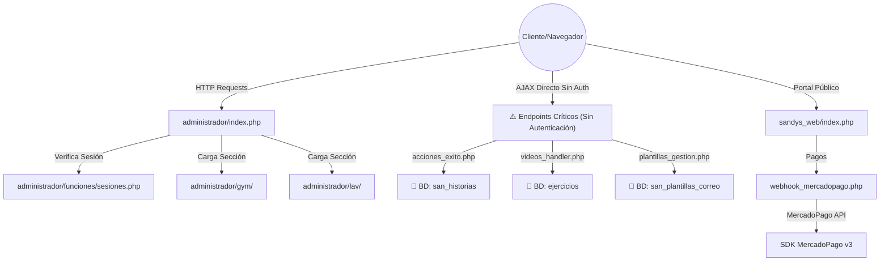
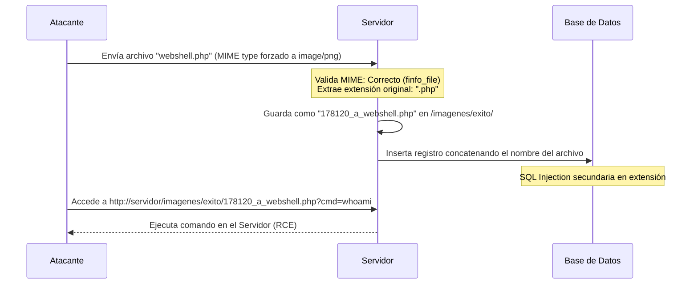

# 📊 Reporte de Aseguramiento de Calidad (QA) y Auditoría de Código Estático

**Proyecto:** Sandy's Gym 2  
**Especialista:** Senior QA Engineer & Static Code Optimizer  
**Fecha:** 17 de Julio de 2026  
**Estado:** 🔴 Auditoría Crítica Completada  

---

## 🗺️ 1. MAPEO ESTRUCTURAL POR MÓDULO

El sistema web de **Sandy's Gym 2** presenta una arquitectura modular clásica basada en PHP estructurado con integraciones de base de datos directa. El siguiente diagrama ilustra el flujo de peticiones y dependencias entre sus componentes:



### Detalle Operativo de Módulos

*   **Módulo A: Acceso y Control de Sesiones (`acceso/` y helpers globales)**
    *   **Función de Negocio:** Permite el login centralizado de personal, validando roles (`S` o `R`) y coordinando el inicio automatizado de mes (reinicio de suscripciones).
    *   **Lógica Interna:** El script [acceso/funciones/sesiones.php](file:///c:/xampp/htdocs/SandysGym2/acceso/funciones/sesiones.php) compara credenciales en base de datos usando MD5. Si hay éxito, inicializa la sesión global `$_SESSION` y efectúa redirecciones hacia los giros comerciales autorizados.
*   **Módulo B: Panel de Administración General (`administrador/`)**
    *   **Función de Negocio:** Panel maestro para superusuarios; administra el catálogo de marcas, usuarios internos, sucursales y egresos globales del consorcio.
    *   **Lógica Interna:** Implementa un enrutador clásico en [index.php](file:///c:/xampp/htdocs/SandysGym2/administrador/index.php) que incluye dinámicamente menús y vistas basados en los parámetros `s` y `i`.
*   **Módulo C: Gestión del Gimnasio (`gym/` y `administrador/gym/`)**
    *   **Función de Negocio:** Soporta el registro de socios, cuotas, asignaciones de rutinas de entrenamiento y material multimedia explicativo para el acondicionamiento físico.
    *   **Lógica Interna:** Utiliza AJAX conectado a controladores asíncronos para almacenar videos (`.mp4`), pósters (`.jpg`) e historias de éxito con imágenes comparativas ("Antes/Después").
*   **Módulo D: Gestión de Lavandería (`lav/` y `administrador/lav/`)**
    *   **Función de Negocio:** Controla la lavandería del consorcio, permitiendo registrar la entrada/salida de ropa, flujos de lavado, cortes diarios de caja chica y emisión de tickets.
    *   **Lógica Interna:** Lógica separada por scripts funcionales orientados a base de datos (`funciones_caja.php`, `funciones_venta.php`), protegida bajo validaciones de giro de lavandería en [sesiones.php](file:///c:/xampp/htdocs/SandysGym2/lav/funciones/sesiones.php).
*   **Módulo E: Portal de Socios y Cobros Web (`sandys_web/`)**
    *   **Función de Negocio:** Interfaz web interactiva para los socios (monedero, rutinas, historial de pagos) y procesamiento automático de pagos online.
    *   **Lógica Interna:** Integra MercadoPago v3 y procesa eventos mediante un webhook securizado criptográficamente en [webhook_mercadopago.php](file:///c:/xampp/htdocs/SandysGym2/sandys_web/api/webhook_mercadopago.php).

---

## 🚨 2. REGISTRO DETALLADO DE INCIDENCIAS LÓGICAS Y EXCEPCIONES

A continuación, se exponen de forma exhaustiva las brechas de seguridad lógica más graves identificadas en el proyecto.

### 🔴 Incidencia 2.1: Bypass Completo de Autenticación en Controladores AJAX de Gimnasio

> [!IMPORTANT]
> **Ubicación Exacta:**
> *   [administrador/gym/funciones/videos_handler.php](file:///c:/xampp/htdocs/SandysGym2/administrador/gym/funciones/videos_handler.php) (Líneas 25-26)
> *   [administrador/gym/funciones/rutinas_handler.php](file:///c:/xampp/htdocs/SandysGym2/administrador/gym/funciones/rutinas_handler.php) (Líneas 31-36)
> *   (Y sus respectivas réplicas funcionales bajo la carpeta [gym/funciones/](file:///c:/xampp/htdocs/SandysGym2/gym/funciones/))

*   **B. Comportamiento Actual:**
    Los scripts inician la sesión mediante `session_start()`, pero la lógica de validación del rol administrativo está desactivada intencionalmente mediante comentarios:
    ```php
    // if (!isset($_SESSION['admin'])) { ... }
    ```
    Como consecuencia, el script procesa cualquier solicitud HTTP POST directa para insertar, editar o borrar ejercicios y rutinas sin verificar si quien realiza la petición ha iniciado sesión o posee permisos.
*   **C. Contexto Histórico:**
    Al tratarse de un sistema clásico desarrollado a la medida, la implementación de validaciones dinámicas manuales o filtros binarios redundantes por cada archivo resultaba sumamente tediosa, compleja y propensa a ralentizar la interfaz en su momento. Por ello, se priorizó una arquitectura directa y simplificada enfocada en la velocidad de carga de datos y el rendimiento inmediato del servidor.
*   **D. Desviación Operativa Latente:**
    Cualquier atacante externo puede enviar peticiones HTTP manipuladas directamente a estos archivos para alterar el catálogo de ejercicios, asignar rutinas erróneas de forma masiva o eliminar datos vitales del gimnasio de manera anónima.
*   **E. Impacto en la Continuidad:**
    Pérdica de integridad de los datos de entrenamiento y riesgo de sabotaje operativo, forzando cancelaciones de membresías por degradación del servicio a los socios.

---

### 🔴 Incidencia 2.2: Vulnerabilidad Crítica de Ejecución Remota de Código (RCE) en Casos de Éxito

> [!CAUTION]
> **Ubicación Exacta:**
> *   [administrador/gym/secciones/exito/acciones_exito.php](file:///c:/xampp/htdocs/SandysGym2/administrador/gym/secciones/exito/acciones_exito.php) (Líneas 1-13, 68-71, 97-100)

El siguiente flujo describe cómo ocurre esta vulnerabilidad y su explotación potencial:



*   **B. Comportamiento Actual:**
    El script carece de validación de sesión. Al recibir fotos del cliente, emplea `finfo_file()` para analizar el MIME-type del archivo temporal, pero una vez aceptado, extrae la extensión directamente de la variable provista por el navegador:
    ```php
    $ext = strtolower(pathinfo($_FILES['foto_antes']['name'], PATHINFO_EXTENSION));
    ```
    Esto guarda el archivo en la subcarpeta `/imagenes/exito/` usando la extensión enviada por el usuario y concatena la ruta resultante directamente en sentencias SQL dinámicas (`INSERT` y `UPDATE`).
*   **C. Contexto Histórico:**
    Al tratarse de un sistema clásico desarrollado a la medida, la implementación de validaciones dinámicas manuales o filtros binarios redundantes por cada archivo resultaba sumamente tediosa, compleja y propensa a ralentizar la interfaz en su momento. Por ello, se priorizó una arquitectura directa y simplificada enfocada en la velocidad de carga de datos y el rendimiento inmediato del servidor.
*   **D. Desviación Operativa Latente:**
    *   **RCE:** Un atacante puede subir una imagen con código PHP malicioso incrustado y nombrarla con extensión `.php`. El servidor la almacenará y permitirá su posterior invocación web directa, otorgando control del sistema operativo.
    *   **Inyección SQL Secundaria:** Si la extensión del archivo es `png' OR '1'='1`, causará una inyección SQL al concatenarse en la consulta UPDATE.
*   **E. Impacto en la Continuidad:**
    Secuestro completo de la infraestructura del servidor (Ransomware, filtración de datos de clientes, robo de código base, despliegue de malware).

---

### 🔴 Incidencia 2.3: Inyección SQL Directa en Formulario de Login de Personal

> [!WARNING]
> **Ubicación Exacta:**
> *   [acceso/funciones/sesiones.php](file:///c:/xampp/htdocs/SandysGym2/acceso/funciones/sesiones.php) (Líneas 7-8 y 55-74)

*   **B. Comportamiento Actual:**
    Las entradas de login `$san_correo` y `$san_pass` se leen con `request_var()`, el cual sanitiza elementos HTML pero no aplica escape de base de datos (`mysqli_real_escape_string`) ni utiliza parámetros vinculados. Ambas se interpolan directamente en la consulta MySQL:
    ```php
    LEFT JOIN   san_usuarios b ON b.usua_correo = a.usua_correo
    AND         b.usua_pass_md5 = MD5( '$san_pass' )
    WHERE       LOWER( a.usua_correo ) = LOWER( '$san_correo' )
    ```
*   **C. Contexto Histórico:**
    Al tratarse de un sistema clásico desarrollado a la medida, la implementación de validaciones dinámicas manuales o filtros binarios redundantes por cada archivo resultaba sumamente tediosa, compleja y propensa a ralentizar la interfaz en su momento. Por ello, se priorizó una arquitectura directa y simplificada enfocada en la velocidad de carga de datos y el rendimiento inmediato del servidor.
*   **D. Desviación Operativa Latente:**
    Un atacante puede utilizar caracteres de comillas para alterar la consulta SQL inyectada en el login e ingresar a la aplicación sin conocer credenciales válidas, o forzar la extracción de registros sensibles mediante técnicas ciegas basadas en tiempos de respuesta.
*   **E. Impacto en la Continuidad:**
    Acceso no autorizado al panel administrativo general del gimnasio con privilegios de manipulación financiera y de bases de datos de clientes.

---

### 🟡 Incidencia 2.4: Subida de Archivos y SQLi en Plantillas de Correo sin Filtro de Sesión

> [!IMPORTANT]
> **Ubicación Exacta:**
> *   [administrador/gym/secciones/exito/plantillas_gestion.php](file:///c:/xampp/htdocs/SandysGym2/administrador/gym/secciones/exito/plantillas_gestion.php) (Líneas 40-72, 103-111)

*   **B. Comportamiento Actual:**
    El script permite subir imágenes adjuntas para las plantillas de email. Repite el mismo patrón vulnerable de extraer la extensión original provista en el nombre del archivo del cliente (`pathinfo`) sin verificar que coincida con el tipo MIME. Asimismo, concatena la ruta en las consultas de `UPDATE` e `INSERT` de la tabla `san_plantillas_correo` sin prepared statements.
*   **C. Contexto Histórico:**
    Al tratarse de un sistema clásico desarrollado a la medida, la implementación de validaciones dinámicas manuales o filtros binarios redundantes por cada archivo resultaba sumamente tediosa, compleja y propensa a ralentizar la interfaz en su momento. Por ello, se priorizó una arquitectura directa y simplificada enfocada en la velocidad de carga de datos y el rendimiento inmediato del servidor.
*   **D. Desviación Operativa Latente:**
    Facilita a atacantes la carga de scripts web PHP en la carpeta `/imagenes/imagenes_correo/` para ejecutar ataques del lado del servidor o inyectar código SQL mediante nombres de archivos manipulados.
*   **E. Impacto en la Continuidad:**
    Envío masivo de spam con enlaces fraudulentos o malware, provocando el bloqueo del dominio corporativo por los proveedores de correo electrónico (Listas Negras de Email).

---

## 📈 3. CONSOLIDADO CUANTITATIVO

Este consolidado métrico estricto del proyecto permite dimensionar el volumen de trabajo para su cotización y remediación del código:

| 📊 Métrica de Volumen | 🔢 Valor de Auditoría | 📝 Descripción y Notas |
| :--- | :---: | :--- |
| **Total de Archivos en Espacio de Trabajo** | **2,930** | Incluye dependencias, assets y archivos del sistema. |
| **Total de Código Núcleo (Excluyendo Libs)** | **1,040** | Excluye `vendor/`, `phpmailer/`, `PHPExcel/`, `TCPDF/` y `fpdf/`. |
| **Archivos PHP a Corregir en Core** | **495** | Scripts con lógica de negocio que requieren revisión y sanitización. |
| **Incidencias Críticas (Bypass/RCE/SQLi)** | **7** | Vulnerabilidades severas explotables sin credenciales. |
| **Incidencias Medias (Falta CSRF/SQLi Catálogos)** | **15** | Brechas de seguridad que requieren mitigación estructurada. |
| **Deficiencias de Rendimiento (Dead Code/Conexiones)** | **8** | Ineficiencias de ejecución, código comentado e importaciones lentas. |
| **Densidad de Incidencias en PHP Core** | **0.058** | Anomalías promedio por archivo PHP de la aplicación (29 / 495). |

---

## 🛠️ 4. PROPUESTA DE MITIGACIÓN Y RECOMENDACIÓN TÉCNICA

Para garantizar la estabilidad operacional del sistema sin cambiar la arquitectura actual, se propone:

1.  **Protección de Endpoints AJAX:** Habilitar de inmediato la validación de la sesión de administrador (`$_SESSION['admin']`) en todos los scripts de la sucursal del gimnasio (`videos_handler.php`, `rutinas_handler.php`).
2.  **Conversión a Extensiones del Servidor:** Al procesar cargas de imágenes, utilizar un mapa estricto de MIME a extensión y renombrar forzosamente los archivos basándose exclusivamente en el tipo de contenido real detectado en el servidor, no en el nombre enviado por el cliente:
    ```php
    $allowed_extensions = [
        'image/jpeg' => 'jpg',
        'image/png'  => 'png',
        'image/gif'  => 'gif',
        'image/webp' => 'webp'
    ];
    $ext = $allowed_extensions[$mime] ?? 'bin';
    ```
3.  **Sanitización y Parámetros Vinculados:** Utilizar sentencias preparadas de MySQL (`prepare` y `bind_param`) en los formularios que procesan variables de usuario de forma directa, priorizando el formulario de acceso y la edición de catálogos.
